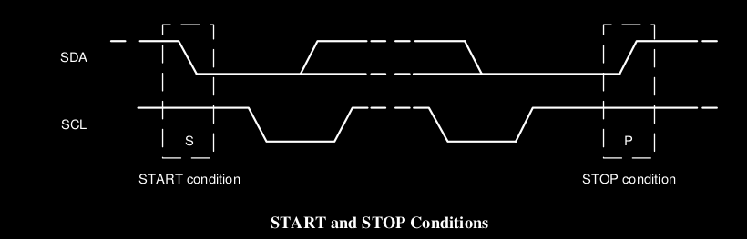

This document describes the ITG-3200 driver for the HC11 Microprocessor.  The ITG-3200 is one of several sensors contained on the DFROBOT 10DOF 10 axis IMU/Gyro package (https://www.dfrobot.com/product-818.html).  It uses the inter-integrated circuit (I2C) protocol to configure the sensor, and provide data to the microprocessor.  The HC11 Evaluation board the driver was tested on was the CME11E9-EVBU AXM-0199 Rev D, available from Axiom Manufacturing.  

## Driver Functions:
The driver implements the I2C protocol to collect hexadecimal values from the following 8-bit registers. `TEMP_OUT_H`, `TEMP_OUT_L`, `GYRO_XOUT_H`,   `GYRO_XOUT_L`,  `GYRO_YOUT_H`,  `GYRO_YOUT_L`,  `GYRO_ZOUT_H`,  `GYRO_ZOUT_L`..  The hex values from those registers are converted into human readable form using constants in the datasheet, and displayed through the BUFFALO monitor.  

# Circuit/Hardware Required
The components required to use the driver are the DFROBOT 10DOF 10 Axis IMU/Gyro package. The CME11E9-EVBU is the board this driver was implemented for.  Even though the HC11 processor on the EVBU is a CMOS device, it still operates on 5V logic levels.  The DFROBOT 10DOF  IMU is  a 3.3V logic level device.  Thus, a level shifter is required.  The level shifter used is the SHILLEHTEK IIC I2C Logic Level Converter.

Wiring:
**ITG-3200**
GND: GND on HC11
Vin  VCC on HC11
SDA: HC11 PD04 -> Level converter high side -> level converter low side -> SDA on ITG-3200.

SCL: HC11 PD05 ->  Level converter high side -> level converter low side -> SCA on ITG-3200.

**Level converter:**
HV: Vcc on HC11
LV: 3.3v (use either voltage divider or companion arduino nano)
GND (high side) : GND on HC11
GND (low side) : GND on HC11


# I2C Protocol

The inter integrated circuit (I2C) protocol is a relatively simple two wire serial interface between a master device, and one or more slave devices.  The EVBU and HC11 serve as the master device.  The slave device is the 10DOF IMU.  The 10DOF IMU and other I2C devices typically have four pins.  `Vin` and `Gnd` for powering the device.  `SCL` is the "serial clock line" and `SDA` is the "serial data line".   An I2C transaction is bounded by a "Start" and "Stop" condition, shown in the figure below. 



The start condition is denoted in logic analyzer protocol decoders as "S".  It occurs when `SDA` goes from high to low, while `SCL` is high.  The stop condition is denoted as "P".  It occurs when `SDA` goes from low to high, whlie `SCL` is high.  This has the effect that data on the bus is only allowed to change while the clock line is low.  Otherwise, we would introduce unintended start and stop conditions.  The dotted lines in the middle of the diagram let us know that any state, other than the `S` or `P` states is possible during the transaction.  

An example of a full communication transaction is shown in the figure below. I'll enumerate the different parts of the I2C transaction, then follow that by explaining what each part is or means.  The transaction is made up of the start condition, a 7 address bits address, a read/write bit,  and ACK or NACK bit, and 8 data bits, followed by another ACK or NACK.  By repeating this process, or slave device specific variations of it, data transfer is possible between the master and slave device.  
![[Pasted image 20241125174315.png]]
Start Condition

| I2C Transation Part            |     Description                  |
| -------------|--------------|
|            Start          |     SDA transitions low while SCL is high, indicates the beginning of communication|
|Address | 7 Bits identifying the slave device |
| R/ $\bar{W}$  |The 8th bit of the address, indicating to read if high, write if low|
| ACK    | On the 9th clock pulse, The line is pulled low if an address is recognized |
|NACK    | On the 9th clock pulse, the line remains high if no communication is acknowledged|
|RA      | Register address, what particular measurement on the ITG-3200 we want to access| 
| Stop    | SDA transitions high while SCL is high, indicating the end of communication|

For the ITG-3200, to read from the bus, the following process is used
![[Pasted image 20241125192924.png]]

### I2C Driver Addresses:
The driver addresses used in my implementation are shown in the following table.  These are the values used in our implementation. 

| Component | Address / Register | Value | Description | 
|---------------|------|-----------------|---------|
|ITG-3200 Write | AD | %11010000| Write Address|
|ITG-3200 Read | AD | %11010001| Read Address |
|TEMP_HIGH| RA | 0x1B| High Byte of Temp |
|TEMP_LOW | RA | 0x1C|Low Byte of Temp|
|GYRO_XOUT_H| RA | 0x1D | Gyro X High|
|GYRO_XOUT_L| RA | 0x1E | Gyro X Low|
|GYRO_XOUT_H| RA | 0x1F | Gyro Y High|
|GYRO_XOUT_H| RA | 0x20 | Gyro Y Low|
|GYRO_XOUT_H| RA | 0x21 | Gyro Z High|
|GYRO_XOUT_H| RA | 0x22 | Gyro Z Low|


# Code and Code Description

### Creating Clock Pulses
The fundamental operation required to implement I2C protocol is the ability to create clock pulses.  On important electrical detail of I2C is that the SDA and SCL lines are pulled up via resistors to 5V.  This means that they will stay high unless a master or slave on the bus forces those lines low.  The SCL and SDA lines of the 10DOF are wired to PORTD pins 5 and 4 respectively.  Port D is a bidirectional general purpose input/output port.  In output mode, it can be controlled by setting the value of the byte stored at `0x1008`.  Setting a 1 to a bit position in `0x1008` will pull the corresponding line to 5V.  Setting a 0 to bit position in `0x1008` will pull the corresponding line to 5V.  

Since Port D is bidirectional, we use the Port D data direction register to control whether we are setting SDA or SCL to an input. DDRD is mapped to the byte at `0x1009` in the EVBU memory.  Setting a bit to 0 assigns the corresponding line in Port D as an input.  Setting a bit to 1 assigns the corresponding line in Port D as an output.  

It's important to keep in mind that I2C is a protocol that can be shared between the master device and potentially several slave devices.  To avoid issues with bus contention, a situation where the master CPU and a slave sensor may both be trying to pull the SDA line high or low unintentionally (be more specific), the following approach is used.  First, DDRD  bits 4 and 5 are set to an output.  Then, in Port D `0x1008`,  bits 4 and 5 are set to the output mode.   Finally, to toggle the bits, the corresponding bits in DDRD are toggled.  

Warning!: Since we are manipulating DDRD this causes all the writes to the HC11 to be backwards of what we may expect.  A write of 0 to the DDRD causes a logic level HIGH on the SCL.  This is shown in the following table.  

| DDRD Value | PortD Value | Logic Level|
|---------------|----------------|---------------|
| 0 | 1| HIGH
|1 | 0 | LOW|

Toggling the bit is an operation that takes place on DDRD.  To achieve logic level LOW, we bitwise-OR DDRD with a byte that contains a 1 in the bit position of the line to be taken low, and 0 everywhere else.  For example, to turn SCL low, the following assembly code can be used.  

```
	ldaa  #%00100000
	oraa  $1009
	staa  $1009
```

To achieve logic level HIGH, we bitwise-AND DDRD with a byte that contains 0 in the bit position to be taken low, and 1's everywhere else.  For exapmle, to turn SDA high, the following assembly code can be used.
```
	ldaa #%00010000
	anda $1009
	staa $1009
```

I chose to leave these as separate instructions. Since this driver doesn't consider rigid speed requirements, it may increase clarity of the code to incorporate these commands into subroutines.  
### Driver Loop
`DRIVER LOOP`

`DRIVER LOOP` is the entry point of the program and by default is set at memory address `0x3400`.  Typing `call 3400` at the BUFFALO monitor prompt starts the driver.  Since the register addresses of the ITG-3200 for meaningful sensor data are arranged in sequential order, the loop is initialized with the `TEMP_HIGH` register address `0x1B` , and the `temp_result` memory address.  From there, both `TEMP_HIGH` and `temp_result` get incremented eight times, so that the eight bytes of data from the internal ITG-3200 drivers are stored in eight sequential memory adddresses starting from `temp_result`.  **Warning**: There is currently a small bug in this loop that causes the data from the ITG-3200 to be stored every other address starting from`temp_result`. Currently it is solved by incrementing the offsets in the printing and math subroutines by 2 instead of by 1.  

The driver loop is additionally responsible for calling the subroutines for converting hex to temperature and degrees per second offset.  Explanations for each of these routines is found in a later section.  

### Main I2C Loop
`MAIN I2C READ LOOP`
This subroutine implements the single byte read sequence, shown in the above section on the I2C protocol.  The subroutines it called are `start_condition`, `ack_nack`, `sb` (send byte), `rb` (read byte), and `stop_condition`.   The subroutines `start_condition` and `stop_condition` use the bit toggling strategy described above to implement the respective conditions.  

The `sb` (send byte) subroutine is a loop that sends one byte, or eight bits from the HC11 to the ITG-3200.  The data to be sent is stored in `send_buffer`.  The clock is set low to allow data to change.  Then, the MSB of `send_buffer` is checked by left rotation, in order to see if a 1 or a 0 needs to be sent.  The carry bit designates the branching condition, and SDA is set or cleared as needed.  From there, the clock is set high again, and the process is repeated until 1 byte is clocked out.  

The `rb` (read byte) subroutine is the complimentary operation to `sb`.  It releases the bus by setting `SDA` high, and allowing the slave device to pull the bus low at its own discretion.  This allows an attached I2C device to communicate.  Then the `read_port` subroutine is called.  The `read_port` subroutine checks the `SDA` bit on Port D by logical right shifting that bit 5 times.  This places the bit in the carry flag.  The carry flag allows the bit (whether it be a 1 or a 0) to be remembered for transfer into the byte stored at `i2cstore`.  The A register looks at whats currently in the `i2cstore` memory location, shifts the carry bit left -- into the A register, and then overwrites the new data back to `i2cstore`.  This process is repeated 8 times until the bit is read. 
## Math conversions
Once raw hex values have been extracted from the sensor and moved to the system memory, they must be converted into a human readable format, and printed onto the serial console.  Because there are no native data types and no FPU or math coprocessor on the HC11, conversion of the hex values to signed values was a challenge.  

### Temperature Conversion
The temperature sensor on board the ITG-3200 has a range of -30 to 85 degrees C, and a sensitivity of 280 LSB/C.  The data sheet provides the temperature offset of -13200 LSB corresponding to 35 degrees C.  The temperature sensor is expected to maintain an accuracy of $\pm 1$ degree when fit to a linear model.  Using the equation below and subsituting the ordered pair $(\text{LSB} = -13200, \text{Temp} =35)$

$$
Temp = m\text{ LSB} + b
$$
gives the following calibration implemented in the driver code. 
$$
Temp = \frac{LSB}{280} + 82.14
$$
### Gyro Conversion
The gyro sensor can detect angular velocity along all three axes as labeled on the 10DOF IMU printed circuit board.  The full scale range is $\pm 2000$ degrees per second. The sensitivity scale factor is $14.375$ LSB per degree per second.  Running the sensor and using the average value of the gyroscope at rest of `0xFED7 = -297`, which corresponded to 0 degrees per second, and the linear slope of $\frac{1}{14.375}$ gives the following linear calibration equation implemented in the driver code.

$$
\text{Rate} = \frac{\text{LSB}}{14.375} +20.66
$$
To avoid dealing with fixed point mathematics, the coefficients of this equation are truncated to the following equation.  
$$
\text{Rate} = \frac{\text{LSB}}{14} +20
$$

It should be noted that the error of this conversion equation increases the faster the gyro is oscillating.  
**Note**: The conversion code should be calibrated separately for each axis, that is use a different resting value for each axis.  It has not been implemented yet. 

**Great care should be taken in ensuring the sign is correct in the division operation**.  


# Important Memory Locations
These memory addresses are current as of 26-November-2024

| Name | Memory Address | Description | 
|-----------------|----------------|-----------------------------------| 
| portd | 0x1008 | Location of Port D data.  In output mode, this sets the voltage on the line. | 
| ddrd | 0x1009 | Port D data direction register, used for setting the bus high or low.  |
| send_buffer | 0x2002 | Used by `sb` to store the byte to be sent over I2C to the ITG-3200.  |
| i2cstore | 0x2000 | Location of incoming byte from slave device |
| register | 0x2008 | ITG-3200 Register Address Storage Location |
| temp_result | 0x2200 | Location of TEMP_HIGH, and start of buffer location (16 bytes), where all incoming sensor data is stored |
| remainder | 0x2302 | Storage for remainder used in temperature hex to degrees C conversion |
| tmp | 0x2600 | Scratch space for math operations |
| conv_res | 0x2240 | Location of human readable form of sensor measurements, pre-bin2bcd |
| store | 0x2990 | Location for digits to be printed to the serial monitor |
| negflag | 0x2008 | Used in division algorithm to ensure sign is consistent|
| register | 0x2292 | ITG-3200 Register Address Storage Location |


# Beneftis
Gives knowledge of how to implement the I2C protocol and a general overview of how it works.  Makes interfacing with other sensors in the future possible.  

# Known Problems:

1. An ACK bit may be sent when the correct sensor I2C address is transmitted, but an incorrect register address is transmitted.  
2. Data is stored every other byte in the raw hex area, i.e. (FE, 00 ED, 00 03 00 BA... etc.) I workaround this by changing the offsets where the math functions are.  
3. The addresses of different data locations and subroutines are spread out for ease of testing.  The finished binary should compress these addresses to the least possible amount of space.
4. Some magic numbers in the code still need to be documented in the "important memory addresses" table.  

# References / Recommended Reading
Documentation for the ITG-3200 found here:
https://www.dfrobot.com/product-818.html

I2C on a 6502 Single Board Computer - The 65uino (Anders Nielsen)
https://www.youtube.com/watch?v=i7q0P9-wszM

Understanding I2C (Rohde Schwarz)
https://www.youtube.com/watch?v=CAvawEcxoPU
